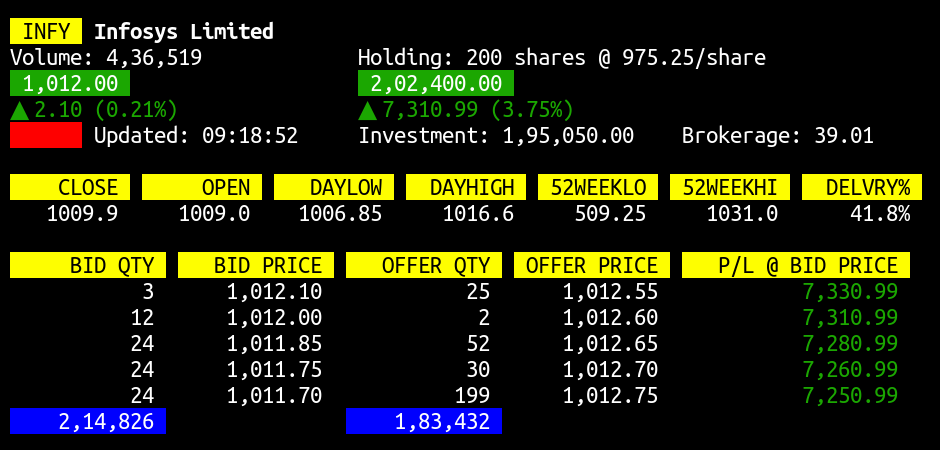

NSE Scrip Watch
=====================

A console-based application (written in Python, using the curses library, for Linux) to track NSE stock prices and your holding for a particular scrip. The scripcode and optionally the quantity, rate and brokerage, can be passed as arguments to the application.

### Usage example

To track the price for Infosys Ltd. (code: INFY) where you have bought 200 shares @ Rs.975.25 each, with brokerage charged @0.01%, execute the following in the terminal:

```bash
$ python3 scripwatch.py INFY 200@975.25 0.01
```

The following will be displayed and updated in real-time:



Press <kbd>Ctrl</kbd> + <kbd>C</kbd> to close the application.

### License

The application is licensed under the MIT License. Copyright &copy; Akash Nag.